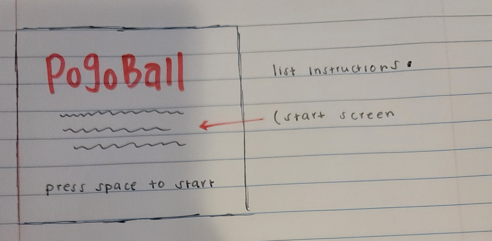
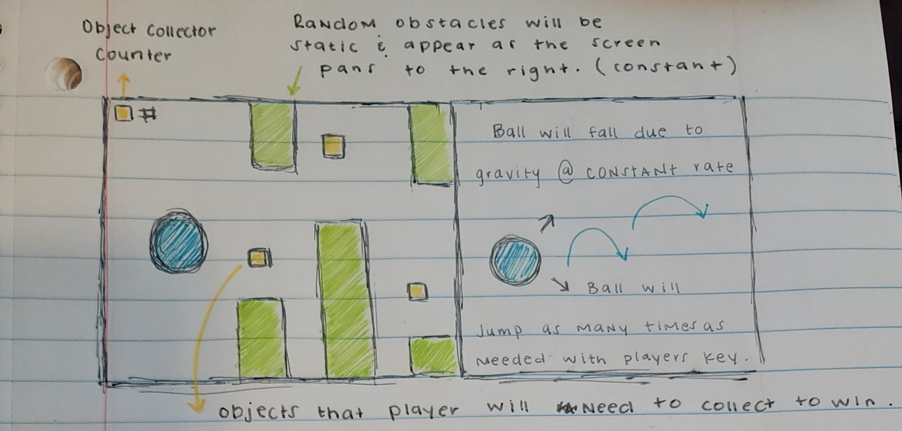
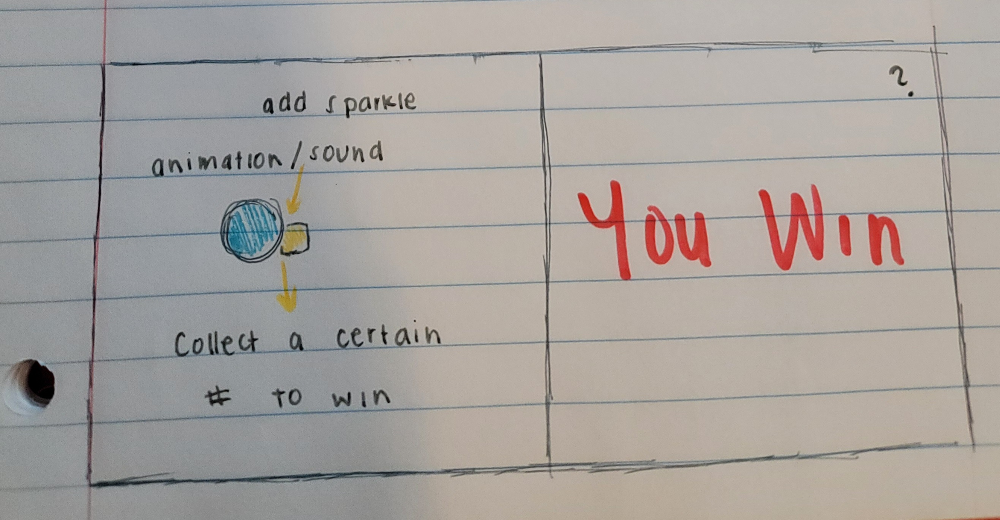
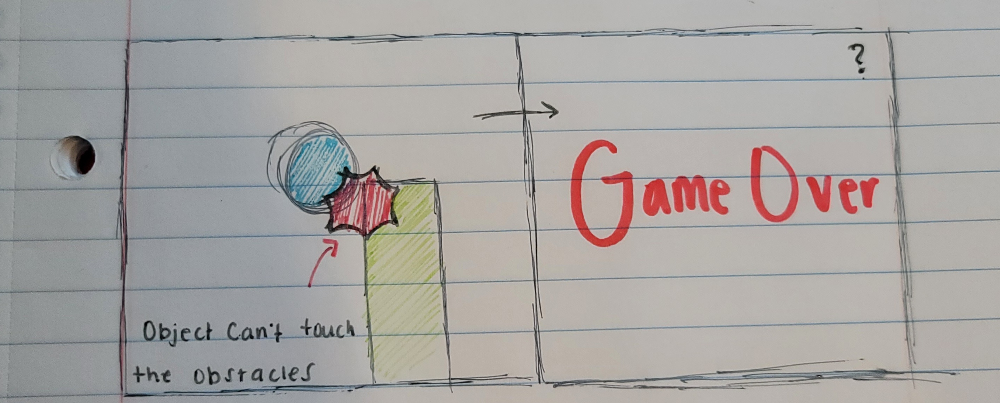

# Star Glider

Star Glider is a Flappy Bird clone but with a slight twist.

- Deployed Link: https://ivycle94.github.io/Project-1/

**Instructions:**
 The player will gradually fall due to gravity so they must press the jump key to keep the ball stabilized enough to get through the course without touching the obstacles. To beat the game the player must collect 10 stars. 

**Controls:**
Press or hold `Spacebar` to jump.

# Wirefreames
The name and deisgn are not set in stone and can be changed, but for the most part the general layout will be like this:
- **Start Screen:**
 This screen will display the instructions of the game, and will require the player to press a key to start the game.

**Layout:**

# Stretch Goals

- Implement sprites and animations. 

- Add styling to make the overal design more visually appealing.

- Add more levels

- Coming soon...
